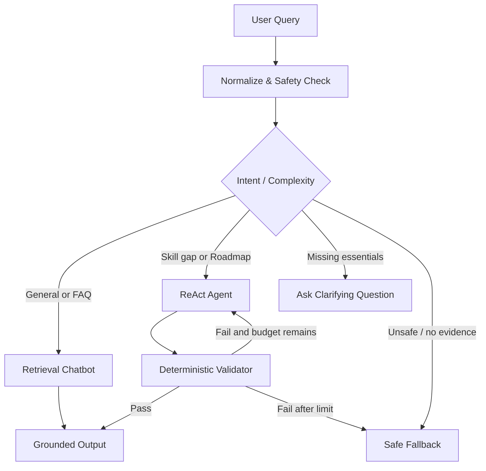

# Architecture

## Recommended pattern

A **hybrid system**:

```text
Deterministic triage
+ Retrieval chatbot for simple knowledge requests
+ ReAct agent for personalized multi-step analysis
+ Deterministic validators for critical constraints
```

## Component boundaries

| Component | Responsibility | Must not do |
|---|---|---|
| Router | Select simple/agent/clarify/fallback path | Generate career advice |
| Retriever | Find role/skill/project records | Invent missing facts |
| LLM Chatbot | Explain grounded content | Call tools in baseline |
| ReAct Agent | Select tools and synthesize multi-step result | Bypass validators |
| Skill Gap Engine | Deterministic comparison/scoring | Generate free-form claims |
| Roadmap Validator | Check time/prerequisite/overload | Rewrite roadmap |
| Profile Store | Store consented user facts | Store hidden inferences |
| Trace Logger | Store safe trajectory metadata | Store hidden chain-of-thought |

## Suggested state

```python
class CareerAgentState(TypedDict):
    messages: list
    user_id: str | None
    intent: str | None
    target_role: str | None
    target_level: str | None
    constraints: dict
    role_requirements: list
    skill_profile: list
    skill_gap: dict | None
    roadmap_draft: dict | None
    validation_errors: list[str]
    tool_history: list[dict]
    step_count: int
    stop_reason: str | None
```

## Hybrid routing



## Recommended MVP tools

1. `search_roles`
2. `get_role_requirements`
3. `get_user_skill_profile`
4. `analyze_skill_gap`
5. `search_learning_resources`
6. `build_roadmap`
7. `validate_roadmap`

For Lab 3, implement at least two:
- `get_role_requirements`
- `analyze_skill_gap` or `build_roadmap`

## Why not pure chatbot?

A pure chatbot can explain roles but cannot reliably:
- retrieve the current dataset version,
- compare a profile against structured requirements,
- validate a six-month plan,
- adapt when required information is missing.

## Why not agent for everything?

FAQ and definitions are stable, one-step tasks. Agent loops add avoidable latency, cost and failure surface.
